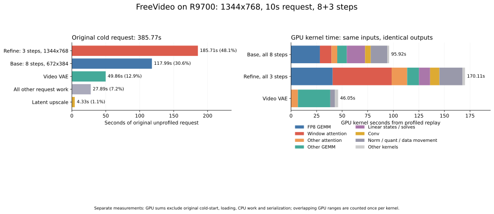

# R9700 官方 8＋3 步配置的逐算子耗时

385.77 秒请求的主要时间在第二轮精化、第一轮采样和视频解码。对相同提示词、种子、模型及 profile 完整复跑并采集全部 11 步后，最大的 GPU 热点是 **窗口 Attention 69.02 秒、FP8 矩阵乘 68.96 秒、视频 VAE FP16 矩阵乘 31.64 秒**。这三类占复跑 GPU kernel 累计时间的 **53.45%**。



## 原始 385.77 秒的阶段分布

下表来自 `official-8plus3-s2-v1/run-00` 的原始请求和引擎回执，是未启用 profiler 的 JIT 冷启动。各项互不重叠，总计 385.770864795 秒。

| 阶段 | 秒 | 请求占比 |
| --- | ---: | ---: |
| 全分辨率精化：1344×768，3 步 | 185.71 | 48.14% |
| 低分辨率采样：672×384，8 步 | 117.99 | 30.59% |
| 视频 VAE 解码 | 49.86 | 12.92% |
| 文本编码及编码器加载 | 8.01 | 2.08% |
| 潜空间上采样阶段 | 4.33 | 1.12% |
| 主模型加载 | 2.96 | 0.77% |
| 视频 VAE 加载 | 2.44 | 0.63% |
| 音频 VAE 加载与解码 | 1.66 | 0.43% |
| MP4 封装 | 1.29 | 0.33% |
| 原始解码输出保存 | 0.09 | 0.02% |
| 请求控制、进程启动、后处理等计时差额 | 11.44 | 2.97% |

最后一项是差额，不能当作独立算子计时。`sample_seconds` 已包含两轮和上采样，`decode_save_seconds`、`work_seconds` 也是包含多个阶段的计时器，不能再加到表中。

## 两轮采样的实际 GPU 算子

以下是**同配置复跑 trace 中的 GPU kernel 时间**，覆盖 50 个 Transformer block 的全部 8＋3 步；没有用单个 block 外推。复跑使用上一轮磁盘 JIT 缓存并带有采集开销，不能把这些值宣称为原始冷启动 385 秒的精确逐算子分解，也不能直接与原始阶段计时相加。

| 算子类别 | 第一轮 8 步 | 第二轮 3 步 | 两轮合计 |
| --- | ---: | ---: | ---: |
| 窗口 Attention | 11.34 | 57.68 | **69.02** |
| FP8 矩阵乘 | 28.24 | 40.72 | **68.96** |
| 全局 Attention | 5.63 | 15.18 | **20.81** |
| BF16 门控及相关投影 | 8.97 | 11.01 | **19.98** |
| GPU Copy/Cast | 5.79 | 6.94 | 12.73 |
| Gather/Scatter/索引及相关融合 | 4.41 | 6.88 | 11.28 |
| Cholesky 与三角求解 | 7.40 | 2.83 | 10.23 |
| FP8 量化、缩放及 SwiGLU/RowMax 融合 | 3.91 | 5.47 | 9.38 |
| 时间卷积 | 2.68 | 4.65 | 7.33 |
| 空间 depthwise 卷积 | 2.85 | 4.44 | 7.29 |
| 状态扫描中的矩阵乘 | 5.22 | 1.97 | 7.20 |
| Norm 及其融合 kernel | 2.19 | 3.31 | 5.50 |
| 状态统计中的矩阵乘 | 2.47 | 3.18 | 5.65 |
| 状态读出及其中的其他矩阵乘 | 1.92 | 2.17 | 4.09 |
| 其他计算 kernel | 2.90 | 3.68 | 6.58 |
| **GPU kernel 累计时间** | **95.92** | **170.11** | **266.02** |

表中单位均为秒；融合 kernel 只属于一个类别。状态统计包含 FP32 A 和 BF16 B；状态读出还包含 Alpha 等小投影，不能把整项叫作单一 BF16 BMM。GPU Copy/Cast 是 GPU 内部数据操作，和主机至 GPU 权重搬运分别统计。

FP8 矩阵乘进一步按实际调用位置拆分：

| 位置 | 第一轮 | 第二轮 | 合计 |
| --- | ---: | ---: | ---: |
| FFN up/down | 15.85 | 23.62 | **39.48** |
| Attention Q/K/V 及输出投影 | 12.39 | 17.09 | **29.47** |
| 其他 FP8 调用 | 0.002 | 0.002 | 0.004 |

窗口 Attention 每步从低分辨率的约 1.42 秒增至全分辨率的约 19.23 秒，约 **13.56 倍**；FP8 矩阵乘每步从约 3.53 秒增至 13.57 秒，约 **3.84 倍**。这解释了为什么只有 3 步的第二轮比 8 步第一轮更重。窗口内查询和键序列都增长，计算量随两者乘积增长，是根据几何和 trace 得出的解释。

## 视频解码与其他阶段

视频 VAE 的完整 forward 共 330,824 个 GPU kernel，累计 46.05 秒：

| GPU 计算 | 秒 | VAE kernel 占比 |
| --- | ---: | ---: |
| FP16 矩阵乘 | **31.64** | **68.71%** |
| Attention | 6.73 | 14.62% |
| 其他逐元素和融合计算 | 3.11 | 6.75% |
| Copy/Cast | 2.89 | 6.27% |
| Norm 融合 | 1.67 | 3.63% |
| 卷积、索引等剩余计算 | 0.01 | 0.02% |

对应 `aten::addmm` 的 GPU 时间为 34.39 秒，其中包含矩阵乘及约 2.84 秒内部复制；它与上述 GEMM/Copy 行重叠，不能重复累加。原始 49.86 秒视频解码阶段还包含输出转 CPU、清理等工作。当前使用原有 FP16 Linear 计算缓存和 FP32 Norm。

文本编码 trace 的 kernel 累计为 2.39 秒；潜空间上采样为 2.08 秒；音频 VAE forward 为 0.79 秒。它们和原请求的 8.01、4.33、1.66 秒阶段计时不同，前者按 GPU 计算体统计，后者包含各自加载与控制工作。

## 计算还是等待

以下窗口从各阶段第一个到最后一个 GPU 事件定义，包含所有流，GPU 忙碌按区间并集合并：

| 阶段 | GPU 事件窗口 | GPU 忙碌占比 | 与计算不重叠的搬运 | 事件间空闲 |
| --- | ---: | ---: | ---: | ---: |
| 第一轮 | 102.86 秒 | 93.38% | 0.147 秒 | 6.81 秒 |
| 第二轮 | 173.04 秒 | 98.15% | 0.033 秒 | 3.20 秒 |
| 视频 VAE forward | 48.62 秒 | 94.71% | 0 秒 | 2.57 秒 |

当前这三段主要受计算 kernel 影响，权重搬运大多与计算重叠。此结论限定于已采集的计算窗口，不包括原冷启动在第一个 GPU 事件前的编译、加载和进程初始化。kernel 时间求和与忙碌区间并集分别保留，避免把不同流重叠的执行时间当作额外壁钟时间。

## 优化优先级

1. **全分辨率窗口 Attention**：第二轮占 57.68 秒。针对 [`rocm_attention.py`](../../freevideo_engine/rocm_attention.py) 的真实窗口形状比较 query/key tile、warp 数、布局和流水线策略，保留完整 mask、键集合和 BF16/FP32 计算合同；局部结果需计入布局转换成本。
2. **FP8 FFN 和投影**：合计 68.96 秒，其中 FFN 为 39.48 秒。分别评估 `5376→28672` 的 FF up、FF down 与 Q/K/V/输出投影，检查 chunk 和 GEMM 选择，保持现有 FP8 量化、BF16 输出及 scale 合同。
3. **视频 VAE FP16 GEMM**：31.64 秒，另外 `addmm` 内部复制约 2.84 秒。先定位 Linear 输入/输出布局和复制来源，再比较 tile 和 epilogue 融合，保留已验证精度。
4. **BF16 门控投影和数据操作融合**：门控约 19.98 秒，量化、索引和 Copy/Cast 也有累计收益空间。[此前 BF16 替换](r9700-operator-replacement.md)有音频筛查回退，后续候选需要完整质量复查。
5. **状态扫描、分解与小矩阵**：调用多但总时间小于前几类，可后续研究减少启动次数；维持原 FP32 状态求解数学。

本轮仅增加采集、统计与可视化工具，生产算子、采样步数和精度配置保持原基线。以上是基于热点排序的优化方向，不是已经验证的加速收益，也不是同条件 CUDA 对照结论。

后续[借鉴 h3-vdn.c 的实现路径调研](r9700-h3-implementation-paths.md)对照 native HIP 优化与当前数学合同，完成算子探针及两种分辨率的真实首块验证，给出可实施候选与应排除的路径。

## 采集、关联与验证

原始请求和模型工作负载见[配置对齐报告](r9700-official-workload.md)。本轮固定相同 R9700 `GPU-b11d6bcf3a61a551`、Docker 镜像、native FP8、window batch 4、head chunk 16、FF chunk 2048、projection chunk 1024、resident blocks 8 和 decoder Linear 缓存。BF16 gate/state 后端保持 `default`，全局 hipBLASLt 开关为 0。

[`profile_official.py`](../../scripts/amd/profile_official.py) 在独立诊断进程中加 CPU 范围标注，复用原请求与新编码的同提示词条件。完整采集 7 个计算阶段，共 **1,502,340 个 GPU kernel、4.42 GB 原始 trace**。全步采集关闭 shape/stack/memory 追踪；shape 追踪会保留张量引用并增加额外开销，见 [PyTorch Profiler 文档](https://docs.pytorch.org/docs/2.14/profiler.html)。VAE forward 之后的 CPU 转换、封装以及 VAE 加载未完整包含在这些计算 trace 中。

[`analyze_official_trace.py`](../../scripts/amd/analyze_official_trace.py) 流式解析 trace，以 External ID 和 HIP launch correlation 关联异步 GPU kernel 与 CPU 标注。全部 kernel 关联率为 **100%**。排除重叠的 `gpu_user_annotation`，每个 kernel 只归入一个类别，分类之和严格等于该阶段 kernel 时间。计数表示 GPU kernel 数，不等于 CPU 算子调用数。

复跑的提示词条件和最终 video/audio latent 逐元素完全相同；243 帧原始 RGB、原始音频和音频解码输入也完全一致。完整音视频解码检查通过，无黑帧和相邻重复帧，张量/音频有限值及饱和检查通过。解析器通过 4 项检查：异步关联、HIP correlation 回退、嵌套卷积/GEMM、区间重叠和大事件/截断输入。

原始数据在 `/dc1/zihaomu/free_token_mapping/experiments/freevideo-r9700/reports/official-operators-20261007`：`original-phase-distribution.json`、`gpu-breakdown.json`、`profile-output-comparison.json`、`tensor-equivalence-v2.json`、`final-validation.json` 和各阶段 trace。初次视频验证缺少诊断输出目录中的 `conditioning.pt`，补齐后由 `verify-v2.log` 完整验证；初次张量审计误比较了输出目录不同的 provenance 路径，改为核对条件和真实 latent 后通过，初始日志保留。冻结的采集脚本版本保留在数据目录，最终工具补齐条件文件保留并使用流式分析替代重复构建 profiler 事件树。

复跑流程先分别调用 profiler 的 `--kind encode` 和 `--kind video`，指定原始 `video.artifacts/encode.json`、`video.artifacts/video.json`，并使用新的 `--out`。视频阶段的 `--conditioning` 指向本次新编码条件。保持原六个后端环境开关，`FV_CACHE_GROUP=official-8plus3-s2-v1` 表示复用原磁盘 JIT 缓存。待 profiler 完成后运行：

```bash
python3 scripts/amd/analyze_official_trace.py \
  --profile-dirs /path/to/encoder-trace /path/to/video-trace \
  --out /path/to/new-gpu-breakdown.json
```
